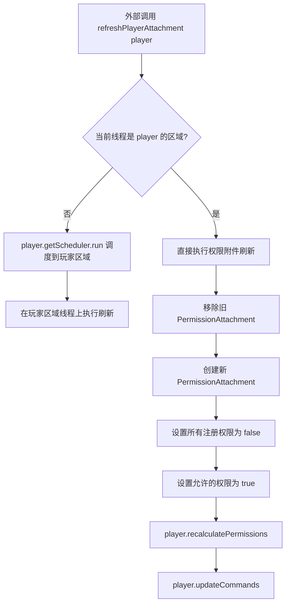
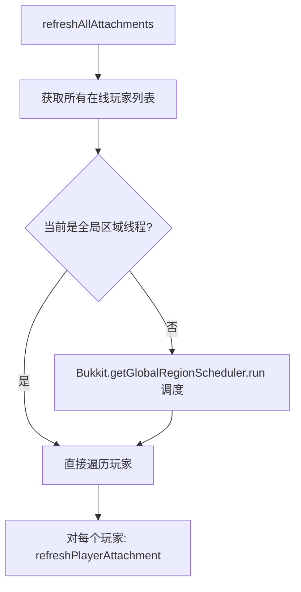

# 即时权限应用修复计划

## 背景

用户反馈 FoliaPerms 权限插件在修改权限后，需要玩家重新加入服务器才会应用更改。经过代码审查，确认权限数据确实被正确保存到内存和 YAML 文件中，但运行时权限附件（`PermissionAttachment`）未能正确刷新，导致更改不立即生效。

## 根本原因

### Folia 线程模型兼容性问题

Folia 使用**区域（Region）线程模型**，没有传统 Bukkit/Paper 的"主线程"概念。当前代码在尝试刷新玩家权限附件时，使用了不兼容 Folia 的调度方式：

```java
// 当前代码（错误）
if (Bukkit.isPrimaryThread()) {          // ← Folia 上永远返回 false
    fp.refreshPlayerAttachment(player);
} else {
    plugin.getServer().getScheduler().runTask(plugin, () -> fp.refreshPlayerAttachment(player));
    // ↑ Folia 上 runTask() 调度到全局区域线程，不是玩家区域线程
}
```

关键问题：
1. **`Bukkit.isPrimaryThread()`** 在 Folia 上总是返回 `false`，因为没有主线程概念
2. **`Bukkit.getScheduler().runTask()`** 在 Folia 上调度到**全局区域线程**，但 `player.recalculatePermissions()` 和 `player.updateCommands()` 需要在**玩家的区域线程**上执行
3. **所有异常被静默吞掉**：`catch (Throwable ignored) {}` 导致线程错误永不记录
4. **`refreshPlayerAttachment()` 本身未检查线程上下文**，直接调用玩家敏感操作

### 受影响代码路径

| 触发方式 | 方法 | 刷新目标 | 问题 |
|---------|------|---------|------|
| 命令 | `PermissionService.addUserPermission()` | 特定玩家 | 线程错误 |
| 命令 | `PermissionService.removeUserPermission()` | 特定玩家 | 线程错误 |
| 命令 | `PermissionService.addGroupPermission()` | 全体玩家 | 线程错误 |
| 命令 | `PermissionService.removeGroupPermission()` | 全体玩家 | 线程错误 |
| 命令 | `PermissionService.addUserToGroup()` | 特定玩家 | 线程错误 |
| 命令 | `PermissionService.removeUserFromGroup()` | 特定玩家 | 线程错误 |
| 命令 | `PermissionService.addGroupInheritance()` | 全体玩家 | 线程错误 |
| 命令 | `PermissionService.removeGroupInheritance()` | 全体玩家 | 线程错误 |
| 命令 | `PermissionService.deleteGroup()` | 全体玩家 | 线程错误 |
| GUI | `GuiListener.togglePermission()` → 服务方法 | 同上 | 同上 |
| GUI | `GuiListener` 处理继承变更 | 全体玩家 | 同上 |

## 解决方案

### 总览

使用 Folia 的正确 API（`player.getScheduler()` 和 `Bukkit.getGlobalRegionScheduler()`）来调度刷新操作，确保它们执行在正确的线程上。

### 修改计划

#### 1. 重构 `FoliaPerms.refreshPlayerAttachment()` ✅



- 新增一个 `refreshPlayerAttachmentSync(Player)` 私有方法，包含实际刷新逻辑
- `refreshPlayerAttachment(Player)` 检查线程，如在错误线程则通过 `player.getScheduler().run()` 调度
- **不再静默吞异常**——记录警告日志

#### 2. 重构 `FoliaPerms.refreshAllAttachments()` ✅



- 使用 `Bukkit.getGlobalRegionScheduler().run()` 而非 `Bukkit.getScheduler().runTask()`
- 遍历在线玩家时，对每个玩家调用 `refreshPlayerAttachment()`（该函数会自行调度到正确的区域线程）

#### 3. 清理 `PermissionService` 中的刷新逻辑 ✅

当前 `PermissionService` 方法同时做两件事：数据修改 + 权限刷新。这导致：
- 刷新逻辑散落在各处
- 命令处理器也重复调用刷新
- 线程处理代码在每个方法中重复

解决方案：将刷新职责集中到 `FoliaPerms` 类：

- `PermissionService` 中的数据修改方法**仅负责数据操作**
- 新增一个 `FoliaPerms.refreshPlayer(UUID)` 公共方法，由调用者（命令/GUI）统一触发刷新
- 或者保持现状但修复线程代码——更保守，改动更小

**我建议采用保守方案**：仅修复 `PermissionService` 中的线程调度代码，不改变整体架构。这样改动最小，风险最低。

#### 4. 修复 `FpermCommand` 中的重复刷新 ✅

当前命令处理器中，`refreshPlayerAttachment()` 被调用了两次（一次在服务方法中，一次在命令处理器中）。移除命令处理器中的冗余调用，让服务方法统一处理。

#### 5. 修复 `GuiListener` 中的用户权限刷新 ✅

`GuiListener.togglePermission()` 对于用户权限，调用服务方法后未对目标在线玩家触发额外刷新。虽然服务方法内部已尝试刷新，但为确保万无一失，可以显式调用刷新。

#### 6. 新增辅助方法 ✅

在 `FoliaPerms` 中新增一个线程安全的公共方法：

```java
public void refreshPlayer(UUID playerId) {
    Player player = Bukkit.getPlayer(playerId);
    if (player != null) {
        refreshPlayerAttachment(player);
    }
}
```

### 文件修改清单

| 文件 | 修改内容 |
|------|---------|
| [`FoliaPerms.java`](src/main/java/kaiakk/foliaPerms/FoliaPerms.java) | 重构 `refreshPlayerAttachment()` 使用 Folia 区域调度器；重构 `refreshAllAttachments()` 使用全局区域调度器；新增 `refreshPlayer(UUID)` 辅助方法；改进错误日志 |
| [`PermissionService.java`](src/main/java/kaiakk/foliaPerms/permissions/PermissionService.java) | 移除所有 `catch (Throwable ignored)` 改为记录警告；修复线程检查逻辑使用 Folia API；方法：`addUserPermission`, `removeUserPermission`, `addGroupPermission`, `removeGroupPermission`, `addUserToGroup`, `removeUserFromGroup`, `addGroupInheritance`, `removeGroupInheritance`, `deleteGroup` |
| [`FpermCommand.java`](src/main/java/kaiakk/foliaPerms/commands/FpermCommand.java) | 移除命令处理器中的重复 `refreshPlayerAttachment`/`recalculatePermissions`/`updateCommands` 调用，让服务方法统一处理刷新 |
| [`GuiListener.java`](src/main/java/kaiakk/foliaPerms/gui/GuiListener.java) | 在 `togglePermission` 处理后，为被修改的在线玩家显式触发 `plugin.refreshPlayerAttachment()` |

### 不修改的文件

- `GroupData.java` —— 纯数据类，无线程问题
- `UserData.java` —— 纯数据类，无线程问题
- `YamlStorage.java` —— 持久化存储，在异步线程中执行，无问题
- `EditorGui.java` —— GUI 渲染，仅触发展开/关闭，无线程问题
- `PlayerListener.java` —— 玩家加入/退出事件，已在正确线程上处理
- 其他工具类

### 测试清单

- [ ] `/fperm user addperm <player> <perm>` —— 目标玩家在线时应立即获得权限
- [ ] `/fperm user removeperm <player> <perm>` —— 目标玩家在线时应立即失去权限
- [ ] `/fperm group addperm <group> <perm>` —— 所有属于该组的在线玩家立即获得权限
- [ ] `/fperm group removeperm <group> <perm>` —— 所有属于该组的在线玩家立即失去权限
- [ ] `/fperm user addgroup <player> <group>` —— 目标玩家立即切换到新组并获得组权限
- [ ] `/fperm user removegroup <player> <group>` —— 目标玩家立即移回默认组
- [ ] `/fperm group setinherit <group> <parent>` —— 继承关系立即影响该组所有玩家
- [ ] GUI 编辑器中切换权限 —— 对应玩家/组立即生效
- [ ] GUI 编辑器中切换继承 —— 组的继承关系立即影响该组所有在线玩家
- [ ] 所有操作后使用 `/fperm check` 验证权限正确性
